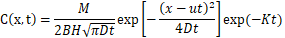
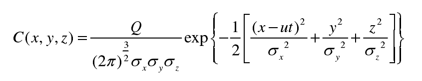
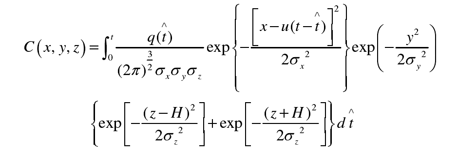

# 模型说明

## 河流污染物一维扩散模型（waterModel/RiverModel)

该模型为瞬时点源污染物扩散模型，适用于罐体由于突然爆炸而导致其内部物质瞬时泄露出来等情况，根据质量守恒定律计算得到模型的解析解为：

 

C: 污染物浓度(mg/m^3 )

x: 与污染源距离(m)

t: 泄露时长(s)

M: 污染物总质量(mg)

B: 河流平均宽度(m)

H: 河流平均深度(m)

u: 水流平均速度(m/s)

D: 扩散系数(m^2 /s)

K: 污染物降解速率常数

采用Elder公式计算污染物扩散系数：
$$
D = 5.93\sqrt{ghi}
$$
i: 河流坡降

参考文献：河流突发污染物的扩散模拟研究_李肖肖

## 气体污染物高斯烟团模型（airModels/InstantModel)

高斯烟团模型适用于罐体由于突然爆炸而导致其内部物质瞬时泄露出来等情况，以瞬时点源的起点为原点，取x轴与平均风向平行，计算公式为：

x,y,z : 距原点的空间坐标位置(m)，二维模型z取0

Q: 污染物泄露总质量(mg)

σ : x,y,z轴上的扩散标准差(m)

u: 平均风速(m/s)

t: 时长(s)

## 气体污染物高斯烟羽烟团混合模型（airModels/ContinuousModel)

该模型适用于罐体破损，气体污染物连续泄露等情况，污染物连续泄露t^ 时间，t^ 时间前可以看作连续泄露的高斯烟羽模型，t^ 时间后视作连续的烟团模型的集合。公式为

t^ : 泄露时长(s)

q: 源强(mg/s)

t: 计算时长(s)

σ : x,y,z轴上的扩散标准差(m)

H: 泄露源高度（代码中作忽略处理）

x,y,z : 距原点的空间坐标位置(m)，（二维模型z取0，代码中已忽略）

参考文献：道路运输危险气体泄露扩散模型构建与应急管理研究_张锦荣

